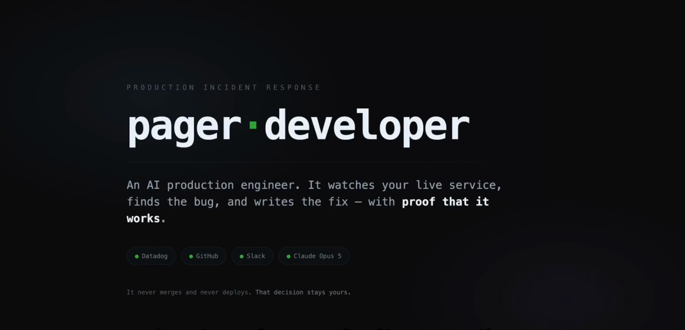
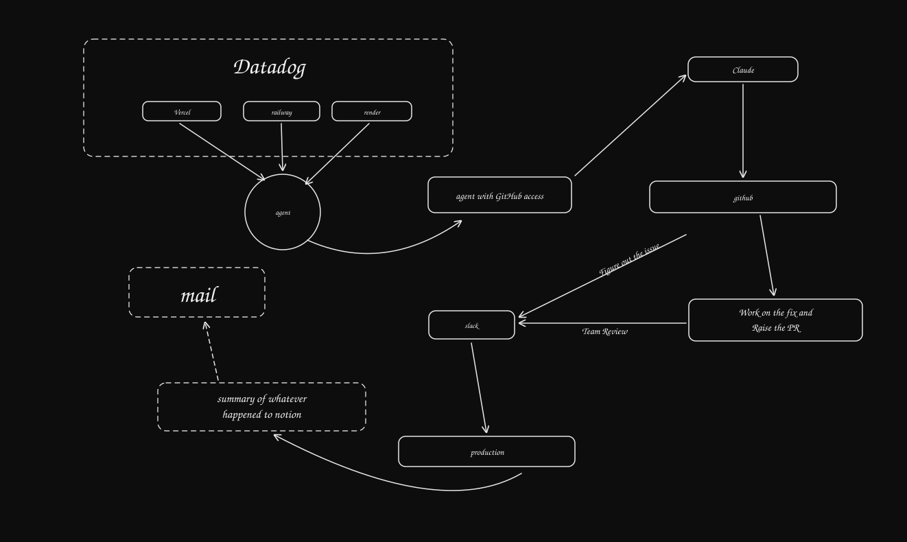

<h1 align="center">Pager Developer</h1>

<p align="center">
  <strong>An AI production engineer that holds the pager.</strong><br/>
  It watches real deployments, investigates real failures, writes and proves a fix,
  and hands a human a reviewable pull request with the evidence attached.
</p>

<p align="center">
  <a href="docs/demo.mp4"><b>Watch the 2-minute demo</b></a> ·
  <a href="https://pager-developer-worker.onrender.com"><b>Live dashboard</b></a> ·
  <a href="https://github.com/he11world/test/pull/12"><b>A pull request it opened</b></a> ·
  <a href="#the-loop-end-to-end">The loop</a>
</p>

---

Production breaks at 3 AM. Someone gets paged, reads a stack trace half-awake, finds
the commit, reproduces the bug, writes the fix, writes the test, opens the PR, and
writes the postmortem the next morning.

Pager Developer does all of that, and stops exactly where a human should take over.

<p align="center">
  <a href="docs/demo.mp4">
    
  </a>
  <br/>
  <sub><b><a href="docs/demo.mp4">▶ Watch the 2-minute demo</a></b> — a real bug, found and fixed end to end</sub>
</p>

<p align="center">
  
</p>

## This is running right now

Not a simulation. A real service on Render, shipping real telemetry to a real Datadog
account, watched by an agent with real GitHub credentials.

| | |
| --- | --- |
| **Dashboard** | [pager-developer-worker.onrender.com](https://pager-developer-worker.onrender.com) — every stage, live |
| **Watched service** | `checkout-api` on Render, reporting its own build revision |
| **Pull requests opened autonomously** | [#5](https://github.com/he11world/test/pull/5), [#9](https://github.com/he11world/test/pull/9), [#12](https://github.com/he11world/test/pull/12) — merged by a human |
| **Merge control** | a button in Slack; the approval is recorded against the person who clicked it |

**The test that matters.** A bug was planted in the checkout service and deployed
without telling the agent what it was, where it was, or that anything had changed.
It found the `TypeError` in Datadog, traced it to
`src/checkout/service.ts`, read the deployed revision from the service's own health
endpoint, reproduced the failure in a sandbox, wrote a regression test that failed
before the patch and passed after it, and opened
[#12](https://github.com/he11world/test/pull/12).

The bug had two failure modes — a missing `destination`, and `rateFor()` returning
`undefined` for an unsupported country. The patch guarded both.

## The loop, end to end

```
Datadog monitor alerts
   │
   ├─ 1  Read what production is actually running   ← from the service, not assumed
   ├─ 2  Is this failure novel?                     ← runbooks say what's already known
   ├─ 3  Investigate                                ← bounded read-tool loop, cited findings
   ├─ 4  Reproduce it                               ← must FAIL, for the predicted reason
   ├─ 5  Write the patch                            ← then the test must PASS
   ├─ 6  Validate                                   ← real processes, real exit codes
   ├─ 7  Open the pull request                      ← evidence attached, Slack merge button
   │
   ▼  a human decides
   │
   ├─ 8  Verify recovery                            ← metrics either side of the merge
   ├─ 9  File the postmortem to Notion
   └─ 10 Mail the team
```

Steps 1–7 are autonomous. Step 8 onward happens only after a person merges.
**The agent never merges and never deploys, at any autonomy level.**

## What makes it trustworthy

Anyone can wire an LLM to a stack trace. The hard part is building something an
on-call engineer would believe at 3 AM. Three properties, each enforced in
application code rather than requested of a model in a prompt:

### Claims cannot outrun evidence

A tool-call id is minted only after a call really executes, and it is the only thing
a finding may cite. The database enforces it too: `evidence.source_tool_call_id` is
`NOT NULL` and foreign-keyed to `tool_calls`. A model cannot fabricate evidence,
because it cannot fabricate an id the recorder never issued.

### Verification means a process ran

A check has passed only when a command exited zero. A skipped check is not a passing
check. Unparseable test output yields `null` counts, never `0` — *"0 failed"* and
*"we could not tell"* must never look alike.

Reproduction requires **FAIL BEFORE** and **PASS AFTER**. A regression test that
passes before the patch is rejected as not exercising the bug. A non-zero exit code
is not a reproduction: the test must fail with a *failing assertion* matching text
the author predicted in advance — a syntax error, a missing module or an
already-red suite are each refused by name.

### Correlation is not causation

The regression detector has no field in which to record deployment blame, so the
shortcut cannot be taken even by accident. Attribution is a separate verdict
requiring its own evidence, and until one exists the incident reads `NOT DETERMINED`
everywhere it appears.

## It knows when to stay quiet

The most valuable thing this system does is refuse.

- **It abstains rather than guess.** Asked to blame a deployment, it has repeatedly
  found the same errors in the baseline *before that deploy existed* and declined to
  attribute — correctly.
- **It refuses to patch on stale telemetry.** If the evidence window doesn't reach
  the present, it says so instead of fixing yesterday's bug.
- **It will not claim a recovery it did not measure.** Post-merge the verdict is
  `RECOVERED`, `NOT_RECOVERED`, or `UNVERIFIABLE`. On `UNVERIFIABLE` the postmortem
  is still filed — saying plainly that nothing could be measured — and the incident
  **stays open** for a human to close. The email subject changes to match. False
  comfort is the failure mode this system exists to prevent.
- **It will not touch its own evidence.** A patch naming the regression test path is
  rejected twice: once by the generator, again by the layer that writes to disk.
- **It refuses to substitute a branch head for the deployed revision.** A patch
  validated against a tree that is not the failing one proves nothing, so the
  workflow halts instead.

## Quick start

Everything below runs with no credentials and no network, against local twins.

```bash
pnpm install

pnpm preflight        # what is reachable: model, Arga twins, Lemma
pnpm eval             # detection suite (deterministic)
pnpm eval:agent       # investigation + repair suite; writes a JSON report
pnpm demo:workflow    # the full incident workflow, alert to team email
pnpm demo:repo        # the demo service's own test suite

pnpm api:seed         # populate the database by running the real pipeline
pnpm api              # API on http://127.0.0.1:4000
pnpm --filter @pager/web dev   # command centre on http://127.0.0.1:4100
```

`pnpm verify` — typecheck, lint, **334 tests**, build — must pass before any commit.

A reasoning model is optional. Without one the system still detects, files, notifies,
reproduces and hands off; it simply never claims to have diagnosed anything.

### Run it as a service

`apps/worker` is Pager Developer with nobody typing anything.

```bash
pnpm --filter @pager/worker start        # watch continuously
pnpm --filter @pager/worker once         # a single check, then exit
```

It requires `PAGER_SERVICE`, `PAGER_REPOSITORY`, `PAGER_HEALTH_URL`,
`PAGER_SLACK_CHANNEL`, the Datadog key pair, `GITHUB_TOKEN`, `SLACK_BOT_TOKEN` and
`ANTHROPIC_API_KEY` — and refuses to start without them. A gap discovered
mid-incident is worse than one discovered at boot.

Optional, and absent means absent rather than broken: `NOTION_TOKEN` +
`NOTION_PARENT_PAGE_ID` for postmortems, and `RESEND_API_KEY` +
`PAGER_EMAIL_FROM` + `PAGER_TEAM_EMAILS` for the team mail.

`PAGER_READ_ONLY=1` drops it to L2 — it investigates, reproduces and validates, but
may not open a pull request.

**It asks the service what revision it is running**, through `PAGER_HEALTH_URL`, and
skips the tick when the service cannot say. Every claim rests on having tested the
tree that is actually failing, so this is never inferred.

One incident per deployed revision. A monitor stays red for as long as the bug is
live, and an agent that opened a pull request on every poll would be
indistinguishable from a denial of service against its own reviewers — so the fix
branch name is derived from the revision, and its existence is the durable record.

### Point it at real infrastructure

Each adapter is chosen from configuration, one at a time. Every run prints which of
its connections are real and which are twins, because that distinction is the whole
claim.

```bash
pnpm probe:datadog <service>    # reports each signal as FOUND or ABSENT
```

Two Datadog credentials are needed and they are not interchangeable: an API key ships
telemetry *in*, but every endpoint Pager reads also needs an **application key**.

## Architecture

```
packages/
  core/           domain types, incident state machine, evidence gate, tool policy
  db/             Drizzle schema, repositories, Postgres-backed telemetry sink
  providers/      GitHub · Datadog · Slack · Jira · Linear · Notion · Resend
  observability/  instrumentation, agent-run and tool-call recording
  agents/         watcher, investigator, patch generator, communication, recovery
  sandbox/        isolated execution, repository profiling, deterministic validation
  twin-local/     offline twin server with real diffs and deterministic reset
apps/
  api/            Fastify read API; owns the database connection
  web/            Next.js incident command centre
  worker/         the autonomous loop + live dashboard + Slack merge endpoint
evals/            scenarios, evaluation harness, demos
demo/checkout-api the service it watches — a real, deployable repository
```

**Adapters are written against real vendor APIs.** There is never an `if (twin)`
branch inside one; backend selection happens once, in the registry. The same code
that talks to the local twin talks to production Datadog.

| App | What the adapter does |
| --- | --- |
| **GitHub** | branches, commits, trees, diffs, pull requests; authenticates as a GitHub App |
| **Datadog** | monitors, logs, metrics — including the reserved-attribute and `monitor_tags` behaviour real accounts actually exhibit |
| **Slack** | threads, replies, interactive blocks, signature-verified callbacks |
| **Notion** | page trees, typed blocks, pagination |
| **Jira** | REST v3, Atlassian Document Format, per-project transitions resolved at call time |
| **Linear** | GraphQL, per-team workflow states |
| **Resend** | team mail |

## Security

The Slack merge endpoint verifies every request: HMAC-SHA256 over the raw body,
constant-time comparison, a five-minute replay window, and a repository allow-list.
The pull request state is re-read from GitHub before any action. Merging requires the
configured autonomy level, and the approval is recorded against the person who
clicked — not against the agent.

Repository content, logs and runbooks are treated as **data, never as instructions**.

---

<p align="center">
  <sub>7 packages · 3 apps · 136 TypeScript files · 28 test suites · 334 tests</sub>
</p>
